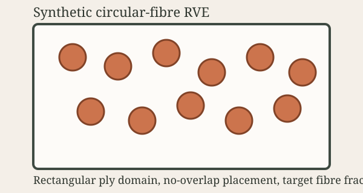
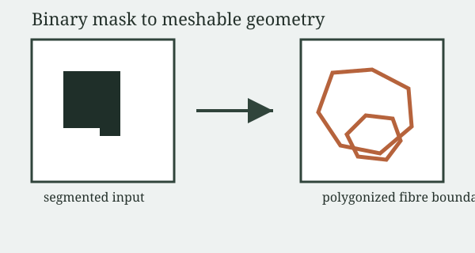

# rve2d-fibre

`rve2d-fibre` is an open-source Python package for building **2D and 3D
representative volume elements (RVEs)** of long-fibre composite plies,
running linear-elastic homogenization on them via [Ferrite.jl](https://ferrite-fem.github.io/),
and running **nonlinear RVE solves** with J2 plasticity in the fibres and matrix and
cohesive-zone fibre/matrix interfaces (PyTorch, with the traction-separation laws of
[diffcohesive](https://pypi.org/project/diffcohesive/) and TensorMesh sparse solvers).

> Despite the historical `rve2d` name, this package now supports both 2D and
> 3D RVEs.




---

## What can it do?

You pick **one of three input modes** and **a dimension**, and the package
takes care of geometry, meshing, periodic-boundary metadata, solver inputs,
the homogenization solve, and post-processing exports.

| Input mode         | Description                                                              | 2D | 3D |
| ------------------ | ------------------------------------------------------------------------ | -- | -- |
| `synthetic`        | Random circular (2D) / cylindrical (3D) fibres in a rectangle / box      | ✅ | ✅ |
| `image`            | Binary segmented mask → polygonal fibres (2D) or extruded volumes (3D)   | ✅ | ✅ |
| `sem_to_synthetic` | Raw SEM micrograph → segment + fit circles/ellipses → clean RVE          | ✅ | —  |

Pipeline stages:

1. **Geometry** — synthetic generator, mask importer, or SEM extractor
2. **Quality validation** — spacing, clipping, disconnected-region checks
3. **Meshing** — gmsh OpenCASCADE Boolean cuts, periodic node matching
4. **Export** — `.msh`, `.xdmf` (or any meshio format), JSON metadata bundle
5. **Homogenization** — Ferrite.jl 2D-triangle / 3D-tetrahedral solve
6. **Post-processing** — homogenized stiffness, engineering constants,
   stress–strain CSVs, `.vtu` for ParaView
7. **Nonlinear RVE solve** (optional) — J2 plasticity + cohesive interfaces
   under periodic BCs and mixed macro strain/stress control; macro
   stress–strain curve, damage and plasticity histories, `.vtu` fields

---

## Installation

```bash
python -m pip install -e ".[gmsh,dev]"
```

Required Python: **3.11+**.

The Julia solve stage additionally requires:

- A working [Julia](https://julialang.org) installation (Julia 1.10+).
- The Julia packages declared in [`julia/Project.toml`](julia/Project.toml).
  Install them once with:

  ```bash
  cd julia && julia --project=. -e 'using Pkg; Pkg.instantiate()'
  ```

If `gmsh` is not installed, geometry generation and validation still work, but
meshing commands will fail with a clear error.

The nonlinear solve (plasticity + cohesive interfaces) is pure Python and needs
the `nonlinear` extra (PyTorch, diffcohesive, TensorMesh):

```bash
python -m pip install -e ".[gmsh,nonlinear]"
python -m pip install pypardiso   # optional, x86 CPUs: several times faster sparse solves
```

---

## Quick start — pick your starting point

The [`examples/`](examples/) tree mirrors the two choices you have to make:
**dimension** and **input mode**.

```
examples/
├── 2d/
│   ├── synthetic/   # random circular fibres in a rectangle
│   ├── image/       # binary mask → polygonal fibres
│   └── sem/         # raw SEM micrograph → mask or fitted circles/ellipses
└── 3d/
    ├── synthetic/   # random cylindrical fibres in a box
    └── image/       # 2D mask extruded into a 3D box
```

### Common commands (run from the repo root)

```bash
# 1. Validate any config first
rve2d validate-config examples/2d/synthetic/basic.yaml

# 2. Build geometry + mesh + metadata
rve2d build           examples/2d/synthetic/basic.yaml

# 3. Build + Ferrite.jl homogenization in one step
rve2d build-and-solve examples/2d/synthetic/periodic_solve.yaml
rve2d build-and-solve examples/3d/synthetic/periodic_solve.yaml

# 4. Build a 2D RVE from a binary segmented mask
rve2d build-and-solve examples/2d/image/basic_solve.yaml

# 5. Build a 3D RVE by extruding a 2D mask
rve2d build           examples/3d/image/extruded.yaml

# 6. Convert a raw SEM micrograph into circular/elliptical fibres
#    (drop your own image at examples/2d/sem/sem_sample.png first)
rve2d build           examples/2d/sem/to_synthetic.yaml

# 7. Run a batch parametric study and aggregate engineering constants
rve2d batch-study \
  examples/2d/synthetic/periodic_solve.yaml \
  examples/2d/image/basic_solve.yaml \
  --output-dir outputs/batch_demo

# 8. Nonlinear RVE: matrix plasticity + fibre/matrix debonding (needs the nonlinear extra)
rve2d build-and-solve examples/2d/synthetic/nonlinear_cohesive_plastic.yaml
rve2d build-and-solve examples/3d/synthetic/nonlinear_cohesive_plastic.yaml
```

The full picker table is in [`examples/README.md`](examples/README.md).

---

## CLI reference

```text
rve2d validate-config CONFIG_PATH
rve2d build           CONFIG_PATH [--output-dir PATH] [--basename NAME]
rve2d solve-ferrite   CONFIG_PATH MESH_PATH --output-dir PATH
rve2d solve-nonlinear CONFIG_PATH MESH_PATH --output-dir PATH
rve2d build-and-solve CONFIG_PATH [--output-dir PATH] [--basename NAME]
rve2d batch-study     CONFIG_PATH [CONFIG_PATH ...] --output-dir PATH
```

`build` writes:

- mesh files (`.msh`, `.xdmf`, …)
- `geometry_summary.json`
- `phase_tags.json`
- `quality_report.json`
- `periodic_pairs.json` (when periodic metadata is enabled)

`solve-ferrite` and `build-and-solve` additionally write:

- `ferrite_homogenization_summary.json`
- `ferrite_homogenization_stdout.txt`
- `homogenized_stiffness.csv`
- `engineering_constants.csv` — `ex, ey, gxy, nuxy, nuyx` for 2D;
  `ex, ey, ez, gyz, gxz, gxy, nuxy, nuyx, nuxz, nuzx, nuyz, nuzy` for 3D
- `stress_strain_response.csv`
- `traction_response.csv`
- `ferrite_homogenization.vtu` (when `solver.write_vtk: true`)

`solve-nonlinear` (and `build-and-solve` when `nonlinear.enabled: true`) writes:

- `nonlinear_response.csv` — macro strain/stress history, interface damage,
  plasticity measures, work density
- `nonlinear_summary.json` — peak stress, initial modulus, convergence statistics
- `nonlinear_final.vtu` and `nonlinear_final_interface.vtu` — displacement,
  stresses, equivalent plastic strain, interface damage and openings

`batch-study` additionally writes `study_summary.csv`.

---

## Configuration cheat-sheet

Top-level keys:

| Key                | Type     | Notes                                                        |
| ------------------ | -------- | ------------------------------------------------------------ |
| `mode`             | string   | `synthetic`, `image`, or `sem_to_synthetic`                  |
| `dimension`        | int      | `2` or `3`                                                   |
| `synthetic`        | object   | Required when `mode: synthetic`                              |
| `image`            | object   | Required when `mode: image`                                  |
| `sem_to_synthetic` | object   | Required when `mode: sem_to_synthetic` (2D only)             |
| `mesh`             | object   | gmsh meshing parameters                                      |
| `export`           | object   | Output dir, basename, formats                                |
| `solver`           | object   | Optional Ferrite.jl material + solve settings                |
| `nonlinear`        | object   | Optional plasticity + cohesive-interface RVE solve           |

YAML and JSON are both supported. See [`docs/configuration.md`](docs/configuration.md)
for every field, default, and example value.

---

## Package layout

```
src/rve2d/
├── cli.py                  # `rve2d` entry point
├── workflow.py             # build_rve / build_and_solve_rve
├── study.py                # batch-study driver
├── config.py               # dataclass schema + YAML/JSON loader
├── models.py               # Domain / Fibre / GeometryModel dataclasses
├── exceptions.py
├── synthetic_generation/
│   ├── circular.py         # 2D circular fibres
│   ├── cylindrical.py      # 3D cylindrical fibres
│   └── sem_image.py        # SEM → fitted circles/ellipses
├── image_import/
│   ├── mask_to_geometry.py     # 2D mask → polygons
│   └── mask_to_geometry_3d.py  # 2D mask → extruded volumes
├── geometry_cleanup/cleanup.py
├── meshing/gmsh_builder.py
├── export/writers.py
├── validation/checks.py
├── ferrite_bridge.py       # subprocess driver + constitutive matrices
└── nonlinear/              # plasticity + cohesive-interface RVE solver (PyTorch)
    ├── mesh.py             # interface node duplication, cohesive elements
    ├── constraints.py      # periodic / affine fluctuation constraints
    ├── material.py         # J2 return mapping + consistent tangent
    ├── cohesive.py         # cohesive elements on diffcohesive laws
    ├── laws.py             # diffcohesive law construction (unit-safe scaling)
    ├── assembly.py         # residual + bordered tangent
    ├── linear_solver.py    # PARDISO / SuperLU / TensorMesh (CPU + CUDA)
    ├── solver.py           # incremental Newton, mixed macro control
    ├── output.py           # CSV / JSON / VTU
    └── driver.py           # config -> solve -> files

julia/
├── ferrite_homogenization.jl       # 2D triangle solver
└── ferrite_homogenization_3d.jl    # 3D tetrahedral solver
```

---

## Homogenization-ready metadata

When `periodic_compatible: true`, the exported metadata includes:

- left/right and bottom/top boundary pairs in 2D
- left/right, front/back, and bottom/top pairs in 3D
- translation vectors and domain size
- boundary physical tag ids

This is solver-agnostic metadata; downstream solvers can use it to construct
periodic constraints. The Ferrite path consumes it automatically.

---

## Ferrite.jl solve stage

- 2D triangle and 3D tetrahedral constant-strain formulations
- Material assignment from gmsh physical phase ids
- Strong periodic constraints on a node-matched periodic mesh
- VTK visualization output (`.vtu`) for ParaView
- 2D phases: isotropic or orthotropic (orthotropic only for `plane_stress`)
- 3D phases: isotropic or orthotropic, with `material_angle_x_deg`,
  `material_angle_y_deg`, `material_angle_z_deg`
- 3D workflows can also propagate phase rotations through geometry metadata
  (`phase_orientation_rotations_deg`)
- Image-import solves accept explicit `matrix_material_angle_deg` and
  `fibre_material_angle_deg`
- Summaries include derived engineering constants and full `material_rotations_deg`
- 3D solves require `kinematics: solid`

**Rotation precedence** (highest to lowest):

1. Explicit solver rotation inputs
2. Geometry metadata `phase_orientation_rotations_deg`
3. Legacy fallback (e.g. 2D `orientation_deg`)

---

## Nonlinear RVE solve: plasticity + cohesive interfaces

The `nonlinear` config section runs a small-strain, rate-independent RVE solve on
the generated mesh:

- J2 plasticity with linear isotropic hardening in the matrix and/or fibres
- zero-thickness cohesive elements on every fibre/matrix interface, with
  diffcohesive's traction-separation laws (mixed-mode bilinear with
  Benzeggagh–Kenane or power-law closure; bilinear, linear-parabolic,
  exponential and trapezoidal shape laws)
- periodic (or affine) boundary conditions with uniaxial-stress or
  uniaxial-strain macro loading, optional unloading
- 2D plane strain or generalized plane strain, and 3D solids
- consistent Newton tangents (the cohesive tangent comes from autograd through
  the law), adaptive load stepping, PARDISO / SuperLU / TensorMesh solvers on CPU
  and TensorMesh on CUDA

See [`docs/nonlinear.md`](docs/nonlinear.md) for the configuration, the
formulation and the verification results.

---

## Development

```bash
pytest                  # run the test suite
ruff check .            # lint
mypy src/rve2d          # type-check (strict)
```

CI runs lint + tests on Python 3.11 / 3.12 / 3.13, plus a job with the
`nonlinear` extra (CPU PyTorch) — see
[`.github/workflows/ci.yml`](.github/workflows/ci.yml). The nonlinear tests are
skipped when PyTorch or diffcohesive are not installed.

---

## Roadmap

- elliptical and polygonal fibre cross-sections in synthetic mode
- waviness and tow-scale path generation
- graded or multi-material matrix regions
- denser periodic packing and edge-wrapping inclusions
- direct export helpers for additional FEM solvers
- true volumetric 3D reconstruction from serial-section / micro-CT slice stacks
- richer 3D orientation input from segmentation metadata

---

## License

MIT — see [LICENSE](LICENSE).
